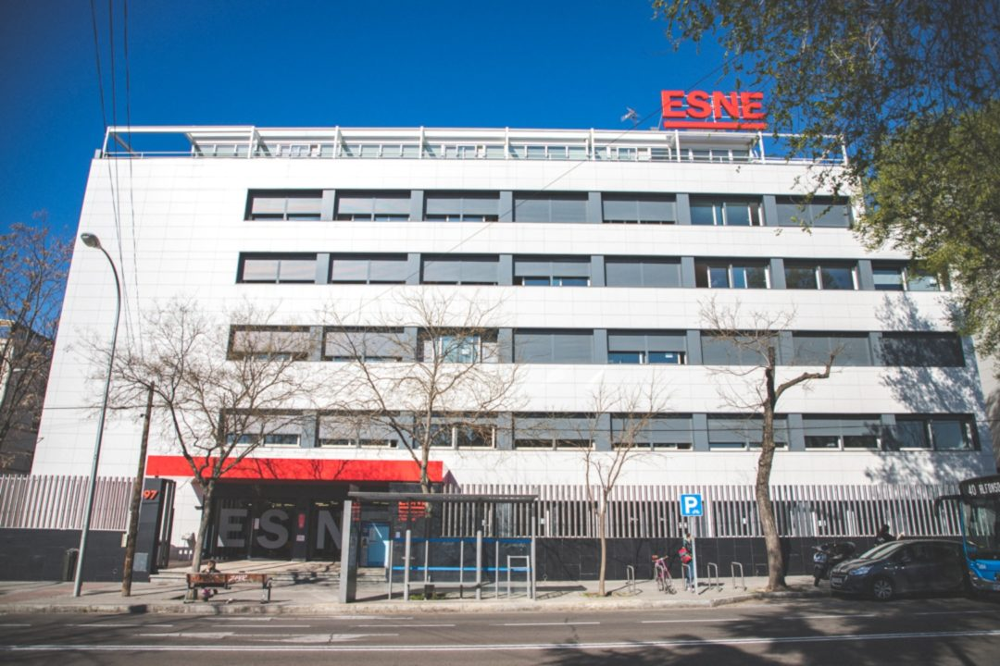
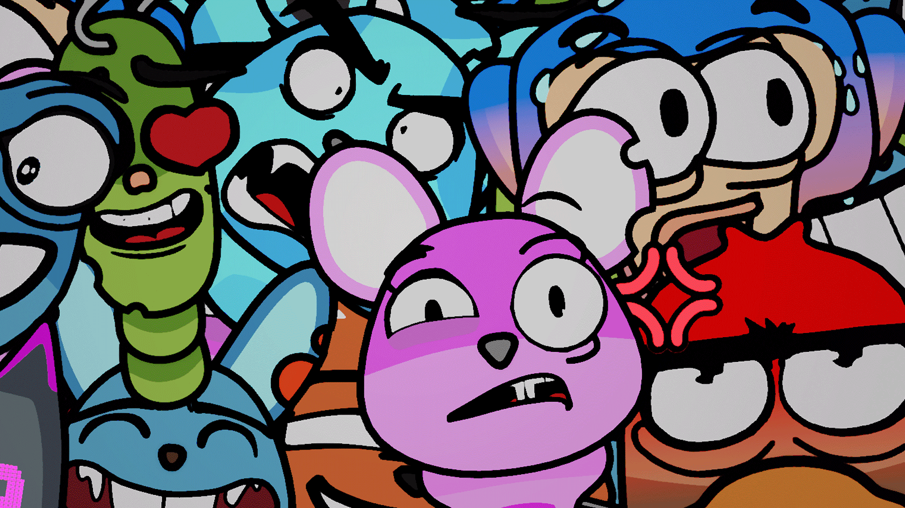
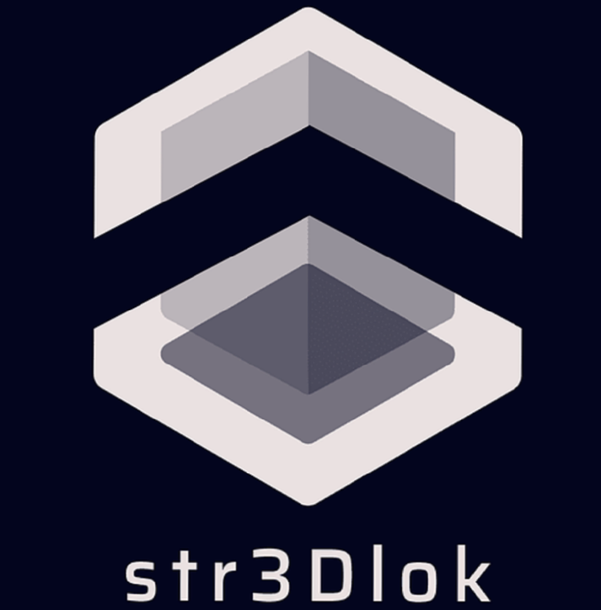

# Blog

Comenzando con mi DevBlog, primero presentaciones:

Soy Alejandro Baeza, un artista 3D de Madrid(España) y tengo 25 años.
Actualmente llevo 4 años en 3D y me especializo en el apartado Técnico del Arte.

Estudié Equitación y soy profesor titulado y después me uní al mundo del 3D.
Mis estudios en 3D son de un grado superior de formación profesional llamado Animación, Modelado 3D y Espacios Interactivos en IED Madrid. 

# Estudios

Ahora mismo estoy en ESNE Madrid estudiando el 2º año de la carrera de diseño de videojuegos

# Experiencia Laboral
Mi experiencia laboral a día de hoy en Septiembre de 2022 ha sido trabajando en Accenture(Consultoría) y creando Experiencias Virtuales 3D para Cupra(Coches)

---

He sido el Artista Jefe de la red social Clivi y de todo el apartado de emotes/reacciones, que saldrá en 2023

---

Por otro lado, he dado clases particulares de Blender 3D (el programa en el que me especializo)

# Youtube

Por último, además de mantener este blog, publico desde hace 2 años tutoriales en YT en el canal de “str3Dlok”(Mi canal) donde me centro actualmente en tutoriales de todos los niveles del programa de Blender 3D, pero que con este proyecto pretendo hacer que es canal se haga un hueco en el mundo de los videojuegos y Developers

---
Si quereis conocerme un poco mas:

<Youtube id="nxuju7-IrAo" />
---
