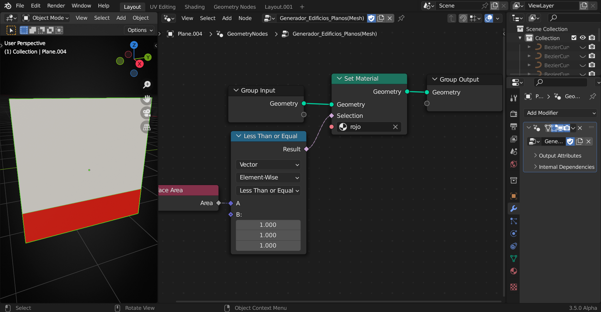

# Nodo Compare

Usando "booleanos" como el nodo "Compare" hace que las selecciones sean muy controlables. En este caso, si el area es menor o igual al area de 1m(3), se asigna el material Rojo, si no da ese resultado, no lo asigna (si no se usa Vector, no da resultado)

<!--  -->